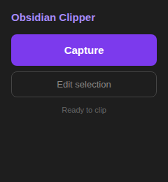
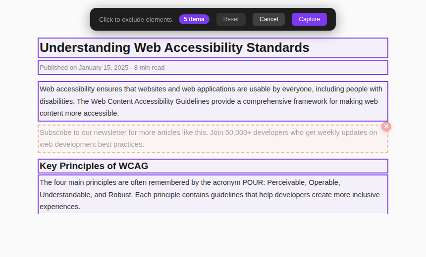

<p align="center">
  
</p>

<h1 align="center">Obsidian Capture</h1>

<p align="center">
  <strong>Capture any web content — LinkedIn, GitHub, Medium, X and more — directly into your Obsidian vault.</strong>
</p>

<p align="center">
  
  
  
  
</p>

---

## About

Obsidian Capture is a Chrome extension that clips web content and saves it directly to your Obsidian vault as clean, readable Markdown. No copy-paste, no formatting headaches.

Each platform is handled by a dedicated extractor — LinkedIn posts preserve author, role and images; GitHub repos capture the README and metadata; Medium articles come in with full content and tags. Every captured note gets a `#Capture` tag and the note title is set from the content itself, never a generic placeholder.

### Popup

<p align="center">
  
</p>

### Edit Selection Mode

<p align="center">
  
</p>

---

## Features

| | Feature | Description |
|---|---|---|
| 🎯 | **Smart Capture** | One click saves the page directly to your vault with proper Markdown formatting |
| 🌐 | **Site-Specific Extractors** | Dedicated parsers for LinkedIn, GitHub, X, Medium, Behance, Dribbble, Facebook, YouTube and Spotify |
| ✏️ | **Edit Selection Mode** | Visually select or deselect page elements before capturing — fine-tune what goes into your note |
| 🏷️ | **Auto Tag** | Every note starts with `#Capture` for easy filtering in Obsidian |
| 🖼️ | **Image Capture** | Detects and includes images from posts, project galleries and carousels |
| 📝 | **Readable Markdown** | Post text is structured into paragraphs, lists and breathing sections — not a wall of text |
| 📁 | **Direct Vault Save** | Files are written directly to your Obsidian vault folder via the File System Access API — no plugins required |
| 🔒 | **No Backend** | Everything runs locally in your browser. No servers, no accounts, no data sent anywhere |

---

## Supported Sites

| Site | What it captures |
|---|---|
| **LinkedIn** | Posts (from feed or direct URL), profiles, job listings, company pages — including images |
| **GitHub** | Repo description, README, stars, forks, language, topics — and issues / PRs |
| **X / Twitter** | Single tweets and full threads, including images |
| **Medium** | Full article content, author, publication, tags, reading time |
| **Behance** | Project title, author, tools, image modules, description |
| **Dribbble** | Shot title, author, tags, tools, main image |
| **YouTube** | Video title, channel, description |
| **Spotify** | Title and metadata |
| **Facebook** | Posts from feed or profile |
| **Any site** | Generic article extractor as fallback — finds and converts the main content |

---

## Output Format

Every captured note follows this structure:

```
#Capture

**Author:** Name
**Desc:** Role or headline
**URL:** https://...

---

Content in clean Markdown — paragraphs, lists, images.
```

The note filename is set from the content title — the first meaningful line of a post, the article headline, or the repo name. Never "LinkedIn Post" or "Untitled".

---

## Installation

Obsidian Capture is a local Chrome extension — no Chrome Web Store listing required.

### 1. Download or clone the repository

```bash
git clone https://github.com/uxdreaming/Obsidian-Capture.git
```

### 2. Load in Chrome

1. Open Chrome and go to `chrome://extensions`
2. Enable **Developer mode** (toggle in the top right)
3. Click **Load unpacked**
4. Select the `obsidian-web-clipper` folder

### 3. Select your Obsidian vault

1. Click the extension icon in the Chrome toolbar
2. Click **Select Vault Folder**
3. Navigate to your Obsidian vault and confirm

That's it. From now on, every capture saves directly into your vault root.

---

## Usage

### Quick capture

1. Open any supported page (LinkedIn post, GitHub repo, Medium article, etc.)
2. Click the **Obsidian Capture** icon in the toolbar
3. The popup shows the detected site — click **Capture**
4. The note appears in your Obsidian vault instantly

### Edit Selection

Use this when you want to pick exactly what goes into the note:

1. Click **Edit selection** in the popup
2. The page enters selection mode — all content elements are highlighted
3. Click any element to deselect it (it turns grey)
4. Click again to re-add it
5. Press **Capture** or hit `Enter` when ready
6. Press `Escape` or click **Cancel** to exit without saving

### Capture from the feed

On LinkedIn (and Facebook), you don't need to open the individual post. The extension detects which post is most visible in your viewport and captures that one.

---

## How It Works

```
Click Capture  →  Detect site  →  Run extractor  →  Format Markdown  →  Save to vault
                  (URL match)     (site-specific    (paragraphs,        (File System
                                   or generic)       lists, images)      Access API)
```

1. **Detect** — The popup matches the current URL against a list of known sites
2. **Extract** — The matching extractor runs in the page context, scoping all queries to the relevant container
3. **Format** — Raw text is structured into readable Markdown: paragraphs, lists, images embedded inline
4. **Tag** — `#Capture` is prepended to every note
5. **Save** — The note is written directly to the vault folder with a clean filename derived from the content

---

## Project Structure

```
obsidian-web-clipper/
├── background/
│   └── service-worker.js     # Handles save requests from Edit Selection mode
├── content/
│   ├── content.js            # All extractors + Edit Selection UI logic
│   └── content.css           # Edit Selection overlay styles
├── lib/
│   ├── turndown.min.js       # HTML → Markdown conversion
│   ├── obsidian-formatter.js # Frontmatter & Markdown helpers
│   ├── storage.js            # Vault handle persistence
│   └── templates.js          # Note templates
├── popup/
│   ├── popup.html            # Extension popup UI
│   ├── popup.js              # Site detection, injection, vault save
│   └── popup.css             # Popup styles
├── options/
│   └── options.html          # Settings page
├── icons/                    # Extension icons (16, 48, 128px)
├── screenshots/              # README screenshots
└── manifest.json             # Chrome Extension Manifest V3
```

---

## Completed Features

| | Feature |
|---|---|
| ✅ | LinkedIn post capture from feed (most visible post in viewport) |
| ✅ | LinkedIn profile, job listing and company page extractors |
| ✅ | LinkedIn post images (scoped to post container, no leakage from adjacent posts) |
| ✅ | GitHub repo extractor (README, stars, forks, language, topics) |
| ✅ | GitHub issue and PR extractor |
| ✅ | X / Twitter single tweet and thread extractor |
| ✅ | Medium full article extractor |
| ✅ | Behance project extractor |
| ✅ | Dribbble shot extractor |
| ✅ | YouTube and Spotify extractors |
| ✅ | Facebook post extractor |
| ✅ | Generic article fallback for any site |
| ✅ | Edit Selection mode — visual element picker |
| ✅ | Turndown-powered HTML → Markdown for clean formatting |
| ✅ | Post text structured into paragraphs and lists |
| ✅ | `#Capture` tag on every note |
| ✅ | Note title derived from content (never a generic placeholder) |
| ✅ | No title duplication inside the note |
| ✅ | Direct vault write via File System Access API |
| ✅ | Permission-aware save from service worker |
| ✅ | No backend, no accounts, fully local |

---

## License

MIT

---

<p align="center">
  <sub>Built with 💜 by <a href="https://github.com/uxdreaming">uxdreaming</a></sub>
</p>
